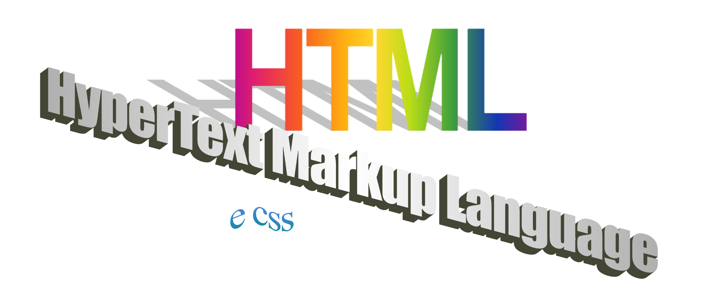

<p align="center"></p>

# O que é o HTML?
 
 HTML é a tecnologia fundamental para definir a estrutura de uma página web. Ele é utilizado para indicar ao browser cada elemento da página web, sejam eles textos, imagens, links, formulários, entre outros.

> HTML vem do 'grego' HyperText Markup Language

<br>

# Elementos do HTML

> A linguagem HTML é formada por tags e atributos.

## Tags
 As tags marcam o início de um elemento do HTML e são formados por comandos, escritos entre os sinais "<" (menor que) e ">" (maior que), e devem ser escritas com letra minúscula
(lembrando que isto não é uma convenção, mas sim uma definição da linguagem. Não existem tags **do HTML** com caracteres em maiúsculo). Exemplos:

- Tags Simples 
```html
    <br/>
```

- Tags Fechadas
```html
    <h1> 
        ...
    </h1>
```

- Tags Compostas
```html
    <div> 
        <h1>
            ...
        </h1>
    </div>
```

## Atributos

Os atributos são pedaços adicionais de informações dos elementos do HTML, como:

```html
    
```

- Neste caso, `src`, `alt`, `class` e `id` (as duas ultimas sendo utilizadas juntamente ao CSS) são atributos da tag `img`, outros atributos do html são `target`, `href`, `background` e `bordercolor`.

> Lembrando que a maioria das tags devem ser abertas `<tag>` e fechadas `</tag>` e, no caso de usar mais do que uma tag, elas devem ser fechadas como "pilha" na ordem que foram abertas: `<div><p><h2>Texto</h2></p></div>`


# Estrutura padrão de uma página Web

Estas tags são a estrutura básica de uma página web:

```html
<!DOCTYPE html> <!-- é a identificação para o browser que o documento que está sendo "lido" se trata de um .html -->
<html> <!-- identificação para o browser que a partir daqui será tudo no mundo do HTML -->
    <head>
        <!-- Aqui são inseridos tags de configuração do documento que não são exibidos para o usuário
        como metadados, carregamento de arquivos externos(JS, CSS, Fontes de texto), ícone e título da página
        entre outros -->
    </head>
    <body>
        <!--é a parte onde tudo que é visível da página é estruturada
        cabeçalho da página, barras de navegação, cards, etc-->
    </body>
</html>
```
> Como pôde ser visto no exemplo acima, as tags `<!-- -->` servem para encapsular comentários
# Outras tags

##  Dentro da  `<head>`
> Para dentro da head, algumas tags são

| Tag  | Uso   |
| ------- | -------- |
| `<title>`  | Título da página (que aparecerá na guia do browser)    |
| `<meta>`  | Onde os metadados da página são guardados (codificação de caracteres, descrição, etc) |
| `<style>` | Inserção de CSS no documento, podendo ser interno ou externo |
| `<link>` | Vincula seu documento com algum arquivo externo |
| `<script>` | Pode conter código JavaScript como conteúdo da tag, ou apontar para um script externo |

Exemplo de `head`

```html
    <head>
        <title>Minha página web</title>
        <meta charset="UTF-8">
        <meta name="description" content="Aqui você pode inserir uma descrição da página.">.
        <meta name="author" content="Gabriel Nicolodi">
        <style> /* a partir daqui pode ser inserido código CSS*/
            body{
                margin: 0;/* Define a margem da tag body como 0*/
                padding: 0; /* Define o "preenchimento" da tag body como 0*/
                background: #d3d3d3; /* Define a cor do background da tag body como #d3d3d3, hexadecimal para cinza*/
            }
        </style>
        <!-- Também podemos definir CSS externo, utilizando link-->
        <link rel="stylesheet" type="text/css" href="style.css"> <!-- Vincula nosso documento com a folha de estilos do tipo text/css que está no diretório atual com o nome style.css-->
        <link rel="icon" type="image/x-icon" href="/img/favicon.ico"><!-- Define o ícone (favicon) da página -->
        <script> // A partir daqui tudo é JS 
            console.log("Script rodando")
        </script>
    </header>
```
> Perceba que, a depender de onde é feito o comentário, o identificador de comentários muda, no caso da tag `<style>`, como tudo que será digitado dentro dessa tag é identificado como CSS, o comentário também deve ser feito no padrão do CSS, que é encapsulando-o com `/* ... */`. Já no caso da tag `<script>`, como tudo dentro dessa tag é JavaScript, os comentários são feitos utilizando `//`, ou também `/* */`. 
<hr>

## Dentro do `<body>`
Para o uso na body do documento, onde temos tudo que é visível da página, podemos dividir em tags de:
### Texto

| Tag  | Uso   | Significado| Exemplo|
| ------- | -------- | -------- | -------- |
| `<h1>` ao `<h6>`  | Utilizada para fazer Títulos no documento | Heading | <h2>h2</h2><h3>h3</h3>|
| `<b>`  | Deixa o texto dentro das tags em negrito | Bold | <b>Bold</b> |
| `<strong>` | Alternativa ao `<b>`, mais legível | Strong kkkk | <strong>Strong</strong> |
| `<i>`  | Deixa o texto em itálico | Italic | <i>Italic</i> |
| `<em>`  | Deixa em itálico também | Emphasize | <em>Emphasize</em> |
| `<mark>`  | Deixa o texto marcado | Marked Text | <mark>Marked</mark> |
| `<small>`  | Texto pequeno | nem te conto | <small>Small Text</small> |
| `<strike>`  | Derruba todos os pinos do boliche(<strike>frase riscada</strike>) | Strike | <strike>Strike</strike> |
| `<u>`  | Texto sublinhado | Underlined Text | <u>Underlined</u> |
| `<ins>`  | Igual `<u>` | Inserted | <ins>Inserted</ins> |
| `<sub>`  | Texto subscrito | Subscript | S<sub>ubscript</sub> |
| `<sup>`  | Texto superescrito | Superscript | S<sup>uperscript</sup> |
| `<hr>`  | Insere uma linha horizontal. Muito utilizado para separar conteúdos | Horizontal Row | <hr> |.

### Link e imagens

| Tag  | Uso   | Significado| Exemplo|
| ------- | -------- | -------- | -------- |
| `<a>`  | Utilizada para links | Anchor | <a href="https://www.youtube.com/watch?v=dQw4w9WgXcQ">NÃO CLIQUE AQUI DE JEITO NENHUM</a>|
| ``  | Utilizado para inserir imagens | Image | <p align="center"> </p>|
| `<video>` | Utilizado para inserir vídeos | hmmm | <a href="https://video.twimg.com/ext_tw_video/1579561426821255183/pu/vid/720x720/d-59uKCjjOsjU_p2.mp4?tag=12"><p align="center"></p></a><br><sub>Infelizmente a tag de vídeo não funciona em markdown, mas tem exemplo embaixo |

```html
    //Uso da <a>
    <a href="https://www.youtube.com/watch?v=dQw4w9WgXcQ">NÃO CLIQUE AQUI DE JEITO NENHUM</a>
    
    //Uso da 
     

    //Uso da <video>
    <video width="320" height="240" controls>
        <source src="./img/video.mp4" type="video/mp4">
        Seu navegador não suporta exibição de vídeo.
    </video>
```

### Outras tags MUITO importantes

- `<div>`
    
    Não possui significado semântico, é utilizada para definir containers na página e, com isso, aplicar as devidas formatações com CSS para o conteúdo da div. É uma das tags que você mais vai ver sendo usada no HTML.

    ```html
        <div class="cabecalho">
            
            <a href="link">
            <a href="link">
            <a href="link">
        </div>
        <div class="navegacao-lateral">
            <ul>
                <li>Elemento</li>
                <li>Elemento</li>
                <li>Elemento</li>
                <li>Elemento</li>
            </ul>
        </div>
    ```

### Outros elementos
    
- `<ul></ul>`
      
  Lista não-ordenada.
      
- `<ol></ol>`
    
  Lista ordenada.
    
> Para adicionar elementos às listas basta inserir `<li>`...`</li>` dentro das tags de lista.
    
- Tabelas
  
  - `<table></table>`
  
    Utilizada para a construção de tabelas, composta por `<tr>` - Table Row(linha), `<th>` - Table Header(cabeçalho) e `<td>` - Table Data(dados)

`Exemplo`
```html
<table>
    <tr>
        <th>Emoção</th>
        <th>To sentindo</th>
    </tr>
    <tr>
        <td>tristeza😢</td>
        <td>sim </td>
    </tr>
    <tr>
        <td>felicidade</td>
        <td>também</td>
    </tr>
</table>
```
Vira
<table>
    <tr>
        <th>Emoção</th>
        <th>To sentindo</th>
    </tr>
    <tr>
        <td>tristeza😢</td>
        <td>sim </td>
    </tr>
    <tr>
        <td>felicidade😎</td>
        <td>também</td>
    </tr>
</table>

> ### Como HTML é um conteúdo muito vasto, muitas coisas estão faltando aqui, mas tudo isso e muito mais você pode encontrar ✨GRATUITAMENTE✨ em [html.com](https://html.com/), ou no [W3Schools](https://www.w3schools.com/html/default.asp) ou no [MDN](https://developer.mozilla.org/pt-BR/docs/Web/HTML) (esse tem em português)

<br>

<h1 align="center">✨CSS✨<br><br>
</h1> 

CSS significa Cascading Style Sheets, ou, Folhas de Estilo em Cascata. É o divisor de águas quando se trata de formatação dos seus sites. Permite que você estilize tudo, desde cor e fonte dos textos até formato de botões, estilo da scrollbar, cor de fundo, literalmente tudo.

## Como funciona o CSS?

Você pode adicionar CSS aos seus documentos HTML de 3 formas:
- Inline;
- Interno;
- Externa

### Inline
```html
    <!-- 
        A estilização é feita na própria linha da tag HTML
        Não recomendo utilizar muito esse modelo, pois acaba sendo mais trabalhoso de 
        fazer manutenções na página mais tarde.   
    -->
    <p style="color: red; font-size: 15px;">
```

### Interno
```html
    <!-- 
        A estilização de forma interna consiste em utilizar a tag <style>
        como foi apresentado no exemplo em HTML
     -->
     <head>
        <meta charset="UTF-8">
        <style> /* a partir daqui pode ser inserido código CSS*/
            body{
                margin: 0;/* Define a margem da tag body como 0*/
                padding: 0; /* Define o "preenchimento" da tag body como 0*/
                background: #d3d3d3; /* Define a cor do background da tag body como #d3d3d3, hexadecimal para cinza*/
            }
            h1 {
                color: blue;
                font-size: 32px;
            }
        </style>
    </head>
```

### Externo
`index.html`
```html
    <!-- 
        Consiste na vinculação do seu arquivo HTML com um arquivo de estilos CSS externo
     -->
    <head>
        <ling rel="stylesheet" type="text/css" href="styles.css">
    </head>
```
`styles.css`
```css
    * {
        margin: 0;
        padding: 0;
    }

    p {
        font-size: 15px;
    }

    h1 {
        color: blue; /* define a cor do texto como azul */
        text-align: center; /* alinha o texto ao centro */
        font-size: 20px; /* altera o tamanho da fonte do texto */
        font-family: verdana; /* define a família da fonte como verdana*/
    }

```

> No caso de multiplas folhas de estilo, caso haja várias estilizações para a mesma tag, a que será aplicada à tag é a ultima que foi declarada na `head` da página.

### Ordem de "importância"
Os browsers que interpretam o código HTML e CSS seguem a seguinte ordem para a aplicação dos estilos CSS, na seguinte ordem de prioridade.
- 1º Inline
- 2º Externa e Interna
- 3º Padrão do navegador

Ou seja, caso você utilize algum estilo inline, ele será sobreposto aos outros estilos aplicados no documento.

## Seletores CSS
Para aplicar as estilizações na página, o CSS utiliza de seletores para selecionar aonde será aplicado cada estilo. E quanto aos seletores, existem 3 princpais, sendo eles:

### Seletor de Elementos
Consiste na seleção de elementos padrão do HTML, como `h1`, `p`, `div`, `img` e todas as outras tags.
```css
    * { /* Este é o seletor universal do CSS, é aplicado a todas as tags do documento */ 
        margin: 0;
        padding: 0;
    }
    h1 {
        text-align: center;
        color: white;
    }
    img {
        border: 4px solid #d3d3d3;
    }
```
> Caso você queira aplicar o mesmo estilo a várias tags, você pode agrupá-las da seguinte forma:
```css
    h1, h2, p {
        text-align: center;
        color: white;
    } 
```
### Seletor de Classe
Lembra do atributo `class` que eu passei na parte de HTML? Então, é ele que usaremos agora.

O seletor de Classe permite que sejam selecionados e estilizados todos os elementos que tiverem a classe atribuída à eles. No CSS, para definirmos um estilo para determinada classe, basta digitar `.nome-da-classe`:

`style.css` 
```css
    .verde{
        color: blue;
    }
    .titulo-reportagem{
        color:red;
        font-size: 36px;
    }
```

`index.html`
```html
    <h1 class="titulo-reportagem"><strong>HOMEM</strong> É ENCONTRADO CALVO NA UTFPR</h1>
```
### Seletor de IDs
Nesse caso, utiliza-se o atributo ID do elemento do HTML para definir o estilo.
A diferença entre ID e Classe é que ID é utilizado para elementos únicos, ao contrário da classe, que pode ser utilizada para estilizar vários elementos da página.

Para estilizar uma ID, utiliza-se `#nome-do-id`:

`style.css` 
```css
    #formulario-email{
        border: 2px solid grey;
        display: flex;
    }
```
`index.html`
```html
    <input type="email" id="formulario-email">
```
> ### Assim como HTML, o CSS é um conteúdo muito vasto, muitas coisas estão faltando aqui, mas tudo isso e muito mais você pode encontrar ✨GRATUITAMENTE✨ em [html.com/css](https://html.com/css), ou no [W3Schools](https://www.w3schools.com/css/default.asp) ou no [MDN](https://developer.mozilla.org/pt-BR/docs/Web/css) (esse tem em português)

<br>

# Tarefa da semana

Crie uma conta no [FreeCodeCamp](https://www.freecodecamp.org/), e comece o curso de Design Web Responsivo, que inclui CSS e HTML from zero to hero.

 No FreeCodeCamp você pode aprender ✨de graça✨ várias tecnologias usadas na Web, inclusive com uma trilha bem formada de HTML, CSS, JavaScript, NodeJS, Python e até preparação para entrevistas de emprego. Inclusive você pode adquirir certificações para decorar seu linkedin.

<!-- Não precisa provar que criou a conta nem que fez o curso, eu confio em você. <small><strike>No fim quem sai prejudicado caso não crie eh vc msm</strike></small> -->
