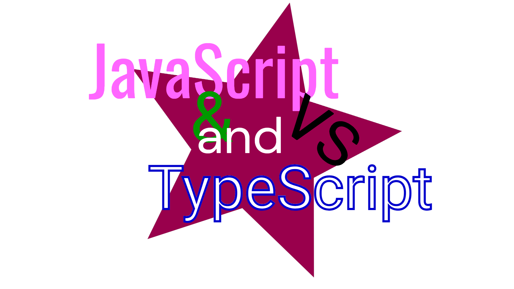

## Variáveis

```js
var nome = "Jeferson";
var idade = 22;
var peso = 64.4;
var ehMembro = true;

var tecnologia = ["javascript", "css", "html"];
var vetorAleatorio = ["texto", 1, true, 2.3];

var pessoa = {
  nome: "Jeferson",
  idade: 22,
  peso: 74.4,
  ehMembro: true,
};
```

## Reatribuição de variável

```js
var idade = 22;
idade = 23;
```

## Impossibilitar a Reatribuição

```js
const idade = 22;
idade = 23;
```

## Funções

```js
function soma(x, y) {
  return x + y;
}

const subtrai = function (x, y) {
  return x - y;
};

const multiplica = (x, y) => x * y;

const divide = (x, y) => {
  return x / y;
};
```

## Condicionais

### `If else`

```js
const nome = "Francisco";

if (nome === "Paulo" || nome === "Francisco") {
  console.log("Olá Paulo ou Francisco");
} else if (nome === "Jeferson") {
  console.log("Olá Jeferson");
} else {
  console.log("Olá desconhecido");
}
```

### `Switch case`

```js
const nome = "Francisco";

switch (nome) {
  case "Jeferson":
    console.log("Olá Jeferson");
    break;
  case "Paulo":
  case "Francisco":
    console.log("Olá Paulo ou Francisco");
    break;
  default:
    console.log("Olá desconhecido");
}
```

## Estrutura de repetição

### `For`

```js
for (var i = 0; i <= 3; i++) {
  console.log(i);
}
```

### `For in`

```js
var arr = [5, 2, 7];
for (var i in arr) {
  console.log(arr[i]);
}
```

### `While`

```js
var x = true;
while (x) {
  console.log("Jane Doe");
  x = false;
}
```

### `Do While`

```js
do {
  console.log("Jane Doe");
} while (false);
```

## Manipulando vetores

### `forEach`
> é uma estrutura de repetição para percorrer o vetor

```js
const arr = [5,2,7,1,3,9,4,6,8];

arr.forEach(function(item, index){
  console.log(item, index);
})

arr.forEach((item, index) => {
  console.log(item, index);
})
```

### `find` e `findIndex`
> serve para buscar um elemento ou o indice deste no vetor

```js
const array1 = [5, 12, 8, 130, 44];

const isLargeNumber = (element) => element > 13;

const isLargeNumberToo = (element) => {
  return element > 10
}

const found = array1.find(isLargeNumberToo) 

console.log(found);
// expected output: 12

console.log(array1.findIndex(isLargeNumber));
// expected output: 3

```

> a função passada como parametro de `find` serve para verificar qual se é aquele elemento que procuramos e por isso retorna um `boolean`

### `includes`
>serve para verificar se o elemento está incluso no vetor

```js
const array1 = [1, 2, 3];

console.log(array1.includes(2));
// expected output: true

const pets = ['cat', 'dog', 'bat'];

console.log(pets.includes('cat'));
// expected output: true

console.log(pets.includes('at'));
// expected output: false

```

### `splice`
>serve para remover elementos do vetor através de seu index

```js
const fruits = ['Apple', 'Banana', 'Strawberry', 'Mango'];
const start = 1;
const deleteCount = 2;
const removedItems = fruits.splice(start, deleteCount);
console.log(fruits);
// ["Apple", "Mango"]
console.log(removedItems);
// ["Banana", "Strawberry"]
```

>também é possível substituir os elementos removidos

```js
const fruits = ['Apple', 'Banana', 'Strawberry'];
const start = -2;
const deleteCount = 2;
const removedItems = fruits.splice(start, deleteCount, 'Mango', 'Cherry');
console.log(fruits);
// ["Apple", "Mango", "Cherry"]
console.log(removedItems);
// ["Banana", "Strawberry"]
```

### `push`
>serve para adicionar elementos ao vetor

```js
const animals = ['pigs', 'goats', 'sheep'];

const count = animals.push('cows');
console.log(count);
// expected output: 4
console.log(animals);
// expected output: Array ["pigs", "goats", "sheep", "cows"]

animals.push('chickens', 'cats', 'dogs');
console.log(animals);
// expected output: Array ["pigs", "goats", "sheep", "cows", "chickens", "cats", "dogs"]

```

### `filter`
>serve para filtrar um vetor, nada óbvio.

```js
const words = ['spray', 'limit', 'elite', 'exuberant', 'destruction', 'present'];

const result = words.filter(word => word.length > 6);

console.log(result);
// expected output: Array ["exuberant", "destruction", "present"]
```

### `map`
>essa a gente vai usar pa carai, a função serve para percorrer o elemento da mesma forma que `forEach` porém ela retorona o vetor com as modificações realizadas se houverem.

```js
const array1 = [1, 4, 9, 16];

// pass a function to map
const map1 = array1.map(x => x * 2);
const map2 = array1.map(x => {
  return x++
});

console.log(map1);
// expected output: Array [2, 8, 18, 32]
console.log(map2);
// expected output: Array [2, 5, 10, 17]

const array2 = ['Jeferson', 'Paulo', 'Francisco'];

const map3 = array2.map((nomes, indice) => `${indice} - ${nomes}`);

console.log(map3);
// expected output: Array ["0 - Jeferson", "1 - Paulo", "2 - Francisco"]

```

## Try catch

```js
function sosma(a, b) {
  if (typeof a !== "number" || typeof b !== "number") {
    throw new Error("Os parâmetros devem ser números");
  }
  return a + b;
}

const nome = "Jef";
try {
  soma(nome, 2);
} catch (error) {
  console.error(error);
}
//expected output: Error: Os parâmetros devem ser números
```

# TypeScript

```ts
function soma(a: number, b: number): number {
  return a + b;
}

const nome: string = "Jef";

soma(3, 2);
```

```ts
const nome: string = "Jeferson";
const idade: number = 22;
const peso: number = 64.4;
const ehMembro: boolean = true;

const tecnologia: Array<string> = ["javascript", "css", "html"];
const vetorAleatorio: Array<any> = ["texto", 1, true, 2.3];

interface IPessoa {
  nome: string;
  idade: number;
  peso: number;
  ehMembro: boolean;
}

const pessoa: IPessoa = {
  nome: "Jeferson",
  idade: 22,
  peso: 74.4,
  ehMembro: true,
};
```
